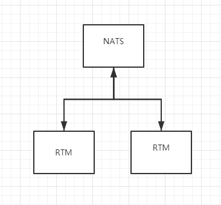

# KissRTM
KissRPC 简单的实时消息传输系统

## 特性
* 房间管理，房间内消息
* 后台发送消息,支持广播消息

## [协议 格式](https://github.com/zs2619/kissrtm/blob/master/schema/rtm.proto) 

## 开发环境
使用vscode docker开发

环境配置文件在 .devcontainer目录.

调试配置launch.json

在vscode中打开工程目录，安装Remote Containers插件, 然后容器内开发调试。
## 技术
* 传输层 支持tcp、websocket 
* 协议层 protobuf

## 构建
make build 压缩包

make buildimage 构建镜像

## 测试环境
docker-compose.yaml

## 细节

rtm服务器将SendRTM消息,推送到nats，然后nats广播消息给rtm再处理。

TODO:
* 可以在redis中存储客户端对应的服务器，做到更精细的发送,代替nats广播
* 验证

